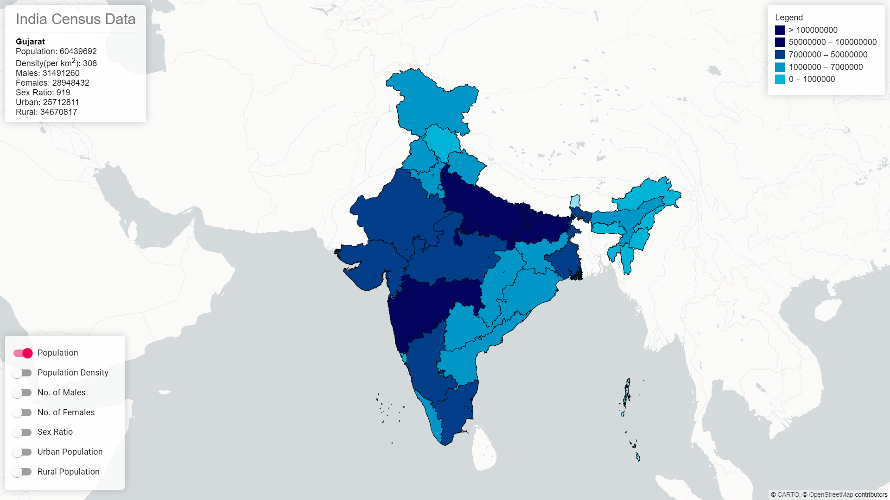

# Indian Census Data Visualization




Web application that geographically maps census data such as popoulation, population density, sex ratio, etc.

App was developed using `NodeJS v14.17.6`, `NPM v6.14.14`

### Develop
1. Clone the repo
2. Install dependencies

    ```
    npm install
    ```
3. To start app

    ```
    npm start
    ```
    This will start the app in browser.

### Build
To compile the source code do:

```
npm run build
```

### Deploy
Currently the app is being hosted using Github Pages.
For deployment using Github Pages, see [here](https://create-react-app.dev/docs/deployment/#github-pages).
